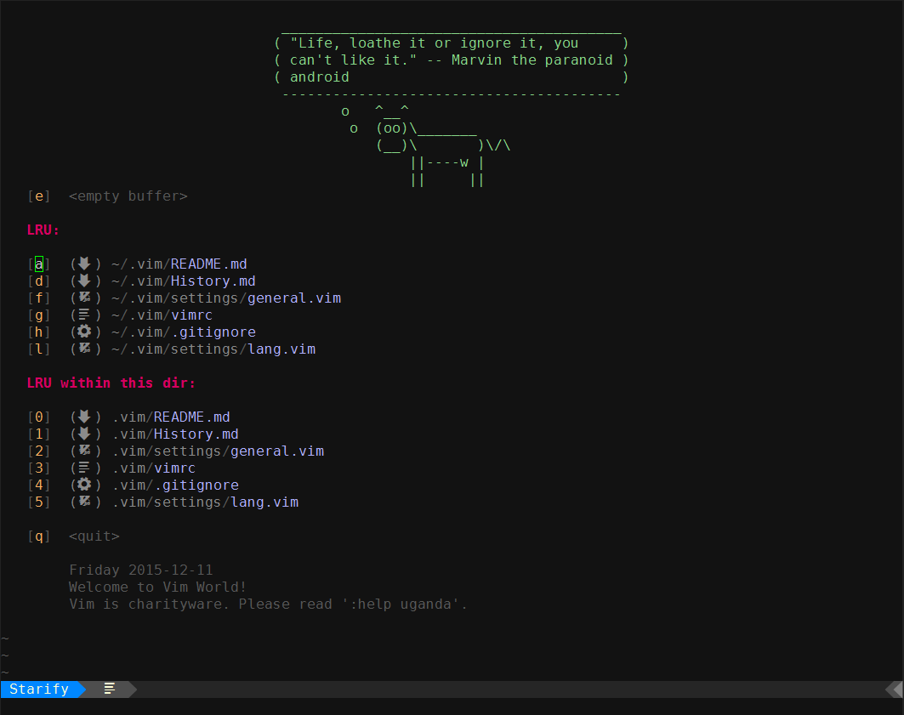

# 我的 vim 配置

+ 最初的配置来自 [spf13-vim][1]，一个相当有影响力的好配置。
+ 创建自己配置的直接原因是 [spf13-vim][1] 在某次 pr 合并后让人用得不爽。
+ 创建配置的另一个原因是自己用 `Vim` 有一段时间了，是时候该自己定制一份专用配置。
+ 现在也还是在完善整个配置，插件增增减减，相应的配置也是如此。但相比最初的配置，个性化程度已经比较高了。
+ 此配置目前希望是有助于`Ruby on Rails`相关项目的开发。

## 配置列表
+ __vimrc__ 主配置文件 -- [neobundle][4] 的初始化

+ __neobundles/__ 插件列表文件夹 -- 所有安装的插件

+ __settings/__ 插件配置文件夹 -- 已安装插件的一些配置与 Vim 的基本配置，与`neobundles`的分组对应

+ __scripts/__ 脚本文件文件夹 -- 包含两个文件
    > 1. [install.sh](scripts/install.sh) -- 创建`tmp`目录、下载`neobundle`插件管理器
    > 2. [post-commit](scripts/post-commit) -- 用于在提交时自动生成变更日志 [History.md](History.md) 的 hook 脚本

+ __bundle__ 插件的安装文件夹

+ __tmp__ vim 的`swap` `undo` `view` `backup`等目录所在的文件夹

+ __session__ vim 的`session`文件所在文件夹

## TODO List
* [x] replace nerdtree with vimfiler

* [x] fix arrow key and esc mapping error

* [x] split plugins list
    - [x] there are three files -- `general.vim`, `lang.vim` and `utils.vim`

* [x] split plugins settings
    - [x] there are four files -- `base.vim`, `general.vim`, `lang.vim` and `utils.vim`

* [x] write some mappings of `unite.vim` ~~acting as `ctrlp.vim`~~
    - [x] there are only two mappings for `unite.vim` defined in `normal` mode when editing in buffer

* [x] clean up neosnippets mappings
    - [x] those mappings are too complicated and most of them seem to be useless.
    - [x] use `<C-k>` to expand and `<Tab>` to jump

* [x] use less plugins as possible, this should be considered at first
    + [x] delete some `useless`(only works for me) plugins
        - [x] I think, for now, the number of plugins should be stable
    + [x] combine some plugins together to `.vim` directory and update them through scripts
        - [x] fork `vim-polyglot` repo and modify it to combine runtimes of multiple languages

* [ ] more customizations for lightline
    + [x] customize statusline
        + [x] trailing whitespace ~~and mixed-indent~~
            - [x] copy and customize function from airline
            - [x] now only checks whitespace
        + [x] wordcount status
            - [x] ~~using `sy#repo#get_stats()` to generate wordcount, only works for files under git control~~
            - [x] consider a new better way to generate wordcount
                - [x] only count word using `wc` when the buffer is saved
        - [x] add hunk from signify function
        - [x] customize symbols for mode
        - [x] add devicons for filetype and fileformat
        - [x] fix syntastic checking frequently issue raised by autocommand defined with `lightline#update()`
    + [ ] customize tabline
        - [ ] components layout for tabline
        - [ ] complete component function
    + [ ] create own colorscheme for lightline
        - [x] copy an existed colorscheme as a sample
            - [x] copied `solarizeed` as sample file but still need some time to read through the doc
        - [ ] modify the sample

* [ ] add more dictionary files for multiple languages
    + [ ] consider to generate dictionary files by parsing tags file

* [ ] documentation of snippets
    + [ ] use them more often
    + [ ] create own snippets cause the existed snippets sometimes do not work for me

* [ ] group plugins (optional)
    + [ ] at least two groups -- `system`(for root user) and `common`

* [ ] write test for my vimrc using vimscript test framework
    + [ ] choose one framework of `vader.vim`, `vim-respec` and `vim-themis`

* [ ] fix issues met in use regularly

## Deprecated TODO
* ~~complete install.sh~~

    > 1. After executing [install.sh](scripts/install.sh), the basic plugin `neobundle` has been installed.
    > 2. When you open `vim`, `neobundle` will take care of all other plugins that need installing.
    > 2. Or, you can execute `vim +NeoBundleInstall +q +q` to install the rest plugins.
    > 3. So, in some way, this [install.sh](scripts/install.sh) is incomplete but enough to use.

* ~~replace neocomplete with youcompleteme~~
    > ~~Just another trying for completion.~~
    > I just cannot stand the slow speed when trying to open tiny files.

* ~~fix rubycomplete issue~~

    > ~~well, this could be difficult.~~
    > ~~`neocomplete` says the `omnicomplete` of ruby provided by other plugins or vim~~
    > ~~has something wrong. If `neocomplete` crashes, users should contact other plugins'~~
    > ~~maintainers or contributors rather than neocomplete's author.~~

    > It seems that `vim-ruby` has fix this issue. What a great job!

* ~~add necessary snippets from [vim-snippets][5] repo~~
    > ~~well, the convert script has been written and still has room to optimize.~~

* ~~add `abbr` to each snippet of snippets in neosnippets directory~~
    > ~~1. `neosnippets` has a option `abbr` in snippets which should show what snippet
    >    is about and what snippet is going to expand. It is composed of some words
    >    used in snippet or other words related to the purpose of snippet.
    > 2. This is difficult for manually adding `abbr`. Maybe it is easier to accomplish
    >    with executing a shell script.~~

    > Well, there is a new repo named [vim-snippets-neosnippet][6] aiming to provide this feature.

## 几点说明
+ 使用该配置前有些工作需要做，请参考 [Requirements](docs/Requirements.md)

+ 之所以用 [neobundle][4] 而不是 [vundle][3]，纯粹是因为当时凑巧`vundle`用不了，
    各种无奈下只好用了`neobundle`
    > 1. `neobundle`的使用过程基本平滑，没有出现问题
    > 2. `neobundle`对插件的各种“花式”写法体现了插件调用的灵活性，大大提高 vim 的启动和运行速度
    > 3. `neobundle`唯一不爽的是没有跟`vundle`一样的直观的插件列表

+ ✓ ~~目前此配置还在向着`1.0`版本进行着，我所期待的`1.0`主要是有以下几点：~~

    > ~~1. 插件基本齐全，多没关系，后面的版本可以慢慢删。但也不能多到插件映射打架~~
    > ~~2. 至少对其中的一些配置写点文档，不然就算是我也难以记住这 n 多的快捷键~~
    >
    > ~~目前第 1 点基本算是修修补补一路搞得差不多了，~~
    > ~~第 2 点目前还没有想好到底要怎么来实现，~~
    > ~~现在的打算是先把`snippets`的文档搞一搞，再把一些常用的操作映射写一写。~~

+ 一些键盘映射可参考文档 [Mappings](docs/Mappings.md)

+ 接下来的目标暂时还没有，只是随时修补、改进

+ 这个配置的整个过程用了 [git-flow-avh][7]，基本的分支流程可以在`network`图中看到。在此也向工具的作者 petervanderdoes 表达谢意。

## 几点事项
1. 这个配置只在 Linux 上（目前是在 ArchLinux）进行使用。
2. 这个配置并不完善，许多地方会有问题。
3. 感谢 __Bram Moolenaar__ 和其他 Vim 的维护者们创造了如此多彩的编辑器。
3. 感谢 __Steve Francia__ 在 GitHub 上分享了这么有用的[配置][1]。
5. 感谢所有插件及插件相关工具的作者与维护者们，你们共同创造了 Vim 与开源社区的现在。

## 许可证
> Copyright 2015 gisphm <phmfk@hotmail.com>
>
> Licensed under the Apache License, Version 2.0 (the "License");
> you may not use this file except in compliance with the License.
> You may obtain a copy of the License at
>
>> http://www.apache.org/licenses/LICENSE-2.0
>
> Unless required by applicable law or agreed to in writing, software
> distributed under the License is distributed on an "AS IS" BASIS,
> WITHOUT WARRANTIES OR CONDITIONS OF ANY KIND, either express or implied.
> See the License for the specific language governing permissions and
> limitations under the License.

[1]: https://github.com/spf13/spf13-vim.git
[2]: https://github.com/gisphm/myneovimrc.git
[3]: https://github.com/VundleVim/Vundle.vim.git
[4]: https://github.com/Shougo/neobundle.vim.git
[5]: https://github.com/honza/vim-snippets
[6]: https://github.com/gisphm/vim-snippets-neosnippet.git
[7]: https://github.com/petervanderdoes/gitflow-avh
